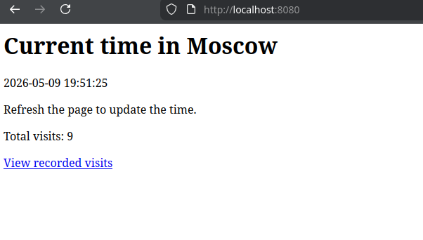

# Moscow Time application

The application shows the current time in Moscow and stores the number of visits in a persistent file.

## Endpoints

- `/` — shows the current Moscow time and increments the visit counter.
- `/visits` — shows the current value stored in the visits file.

## Run with Docker Compose

Go to the app directory:

```bash
cd /app_python
docker compose up --build
```

Open the application:

```text
http://localhost:8080
```



Check the recorded counter on the host machine:

```bash
cat app_python/visits
```

Output:

```test
9
```

Every request to `/` increases the number stored in `app_python/visits`. The file is mounted into the container as `/home/appuser/visits` by `docker-compose.yml`.

Stop the container:

```bash
docker compose down
```
