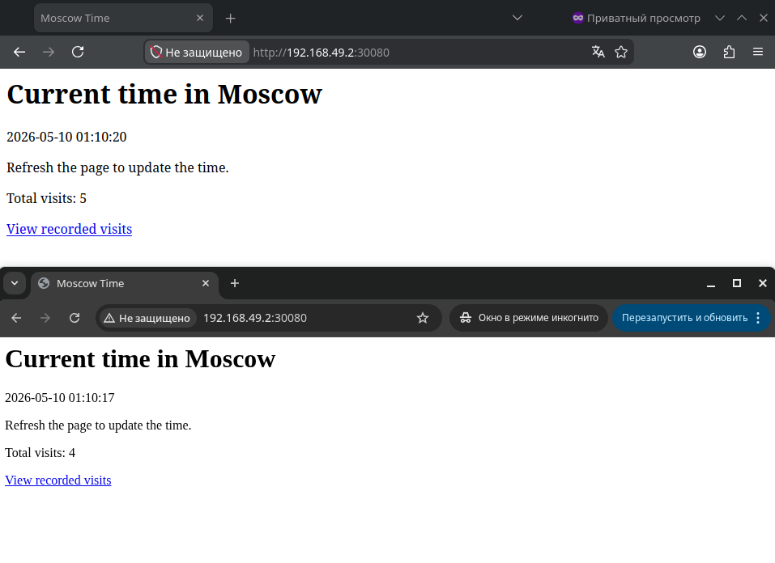
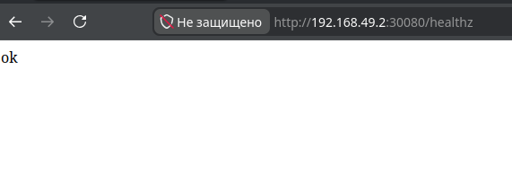

# Kubernetes StatefulSet deployment

This report documents the migration of the Moscow Time application from a Deployment to a StatefulSet with persistent per-pod storage.

## Implementation summary

The Helm chart now renders a `StatefulSet` instead of a `Deployment`:

```text
k8s/moscow-time-app/templates/statefulset.yaml
```

The StatefulSet uses:

```yaml
podManagementPolicy: Parallel
volumeClaimTemplates:
  - metadata:
      name: visits
```

The application writes the visit counter to:

```text
/data/visits
```

The path is passed to the container through the `VISITS_FILE` environment variable.

A headless Service is used for stable StatefulSet DNS names:

```text
moscow-time-app-headless
```

A NodePort Service is kept for browser access:

```text
moscow-time-app
```

## Helm dry run

Command:

```bash
helm install --dry-run --debug moscow-time-app ./k8s/moscow-time-app
```

Output:

```text
level=WARN msg="--dry-run is deprecated and should be replaced with '--dry-run=client'"
level=DEBUG msg="Original chart version" version=""
level=DEBUG msg="Chart path" path=/home/user/Study/devops/DevOps-Core-Course/k8s/moscow-time-app
level=DEBUG msg="number of dependencies in the chart" chart=moscow-time-app dependencies=0
NAME: moscow-time-app
LAST DEPLOYED: Sun May 10 01:02:30 2026
NAMESPACE: default
STATUS: pending-install
REVISION: 1
DESCRIPTION: Dry run complete
TEST SUITE: None
USER-SUPPLIED VALUES:
{}

COMPUTED VALUES:
affinity: {}
containerPort: 8080
headlessService:
  port: 8080
image:
  pullPolicy: Never
  repository: moscow-time-app
  tag: 1.0.0
nodeSelector: {}
persistence:
  accessMode: ReadWriteOnce
  enabled: true
  mountPath: /data
  size: 1Gi
  storageClass: ""
  visitsFile: /data/visits
podSecurityContext:
  fsGroup: 1000
  fsGroupChangePolicy: OnRootMismatch
probes:
  liveness:
    initialDelaySeconds: 15
    path: /healthz
    periodSeconds: 20
  readiness:
    initialDelaySeconds: 5
    path: /healthz
    periodSeconds: 10
replicaCount: 3
resources:
  limits:
    cpu: 500m
    memory: 256Mi
  requests:
    cpu: 100m
    memory: 128Mi
secret:
  enabled: true
  password: moscow-time-secret
  passwordKey: MY_PASS
service:
  nodePort: 30080
  port: 8080
  type: NodePort
statefulset:
  podManagementPolicy: Parallel
tolerations: []

HOOKS:
MANIFEST:
---
# Source: moscow-time-app/templates/secrets.yaml
apiVersion: v1
kind: Secret
metadata:
  name: moscow-time-app-secret
  labels:
    helm.sh/chart: moscow-time-app-0.1.0
    app.kubernetes.io/name: moscow-time-app
    app.kubernetes.io/instance: moscow-time-app
    app.kubernetes.io/managed-by: Helm
type: Opaque
stringData:
  MY_PASS: "moscow-time-secret"
---
# Source: moscow-time-app/templates/service.yaml
apiVersion: v1
kind: Service
metadata:
  name: moscow-time-app
  labels:
    helm.sh/chart: moscow-time-app-0.1.0
    app.kubernetes.io/name: moscow-time-app
    app.kubernetes.io/instance: moscow-time-app
    app.kubernetes.io/managed-by: Helm
spec:
  type: NodePort
  selector:
    app.kubernetes.io/name: moscow-time-app
    app.kubernetes.io/instance: moscow-time-app
  ports:
    - name: http
      protocol: TCP
      port: 8080
      targetPort: http
      nodePort: 30080
---
# Source: moscow-time-app/templates/service.yaml
apiVersion: v1
kind: Service
metadata:
  name: moscow-time-app-headless
  labels:
    helm.sh/chart: moscow-time-app-0.1.0
    app.kubernetes.io/name: moscow-time-app
    app.kubernetes.io/instance: moscow-time-app
    app.kubernetes.io/managed-by: Helm
spec:
  clusterIP: None
  selector:
    app.kubernetes.io/name: moscow-time-app
    app.kubernetes.io/instance: moscow-time-app
  ports:
    - name: http
      protocol: TCP
      port: 8080
      targetPort: http
---
# Source: moscow-time-app/templates/statefulset.yaml
apiVersion: apps/v1
kind: StatefulSet
metadata:
  name: moscow-time-app
  labels:
    helm.sh/chart: moscow-time-app-0.1.0
    app.kubernetes.io/name: moscow-time-app
    app.kubernetes.io/instance: moscow-time-app
    app.kubernetes.io/managed-by: Helm
spec:
  serviceName: moscow-time-app-headless
  replicas: 3
  podManagementPolicy: Parallel
  selector:
    matchLabels:
      app.kubernetes.io/name: moscow-time-app
      app.kubernetes.io/instance: moscow-time-app
  updateStrategy:
    type: RollingUpdate
  template:
    metadata:
      labels:
        app.kubernetes.io/name: moscow-time-app
        app.kubernetes.io/instance: moscow-time-app
    spec:
      securityContext:
        fsGroup: 1000
        fsGroupChangePolicy: OnRootMismatch
      containers:
        - name: moscow-time-app
          image: "moscow-time-app:1.0.0"
          imagePullPolicy: Never
          ports:
            - name: http
              containerPort: 8080
              protocol: TCP
          env:
            - name: VISITS_FILE
              value: "/data/visits"
            - name: "MY_PASS"
              valueFrom:
                secretKeyRef:
                  name: moscow-time-app-secret
                  key: MY_PASS
          readinessProbe:
            httpGet:
              path: /healthz
              port: http
            initialDelaySeconds: 5
            periodSeconds: 10
          livenessProbe:
            httpGet:
              path: /healthz
              port: http
            initialDelaySeconds: 15
            periodSeconds: 20
          volumeMounts:
            - name: visits
              mountPath: /data
          resources:
            limits:
              cpu: 500m
              memory: 256Mi
            requests:
              cpu: 100m
              memory: 128Mi
  volumeClaimTemplates:
    - metadata:
        name: visits
        labels:
          helm.sh/chart: moscow-time-app-0.1.0
          app.kubernetes.io/name: moscow-time-app
          app.kubernetes.io/instance: moscow-time-app
          app.kubernetes.io/managed-by: Helm
      spec:
        accessModes:
          - ReadWriteOnce
        resources:
          requests:
            storage: 1Gi

NOTES:
The Moscow Time application has been installed as a StatefulSet.

Check resources:
  kubectl get po,sts,svc,pvc

Open the application with Minikube:
  minikube service moscow-time-app

Check persisted visits in every pod:
  kubectl exec pod/moscow-time-app-0 -- cat /data/visits
  kubectl exec pod/moscow-time-app-1 -- cat /data/visits
  kubectl exec pod/moscow-time-app-2 -- cat /data/visits
```

## Install

Command:

```bash
minikube image build -t moscow-time-app:1.0.0 ./app_python
helm upgrade --install moscow-time-app ./k8s/moscow-time-app
```

Output:

```text
Release "moscow-time-app" does not exist. Installing it now.
NAME: moscow-time-app
LAST DEPLOYED: Sun May 10 01:07:35 2026
NAMESPACE: default
STATUS: deployed
REVISION: 1
DESCRIPTION: Install complete
TEST SUITE: None
NOTES:
The Moscow Time application has been installed as a StatefulSet.

Check resources:
  kubectl get po,sts,svc,pvc

Open the application with Minikube:
  minikube service moscow-time-app

Check persisted visits in every pod:
  kubectl exec pod/moscow-time-app-0 -- cat /data/visits
  kubectl exec pod/moscow-time-app-1 -- cat /data/visits
  kubectl exec pod/moscow-time-app-2 -- cat /data/visits
```

## Resource state

Command:

```bash
kubectl get po,sts,svc,pvc
```

Output:

```text
NAME                    READY   STATUS    RESTARTS   AGE
pod/moscow-time-app-0   1/1     Running   0          22s
pod/moscow-time-app-1   1/1     Running   0          22s
pod/moscow-time-app-2   1/1     Running   0          22s

NAME                               READY   AGE
statefulset.apps/moscow-time-app   3/3     22s

NAME                               TYPE        CLUSTER-IP       EXTERNAL-IP   PORT(S)          AGE
service/kubernetes                 ClusterIP   10.96.0.1        <none>        443/TCP          159m
service/moscow-time-app            NodePort    10.102.190.128   <none>        8080:30080/TCP   22s
service/moscow-time-app-headless   ClusterIP   None             <none>        8080/TCP         22s

NAME                                             STATUS   VOLUME                                     CAPACITY   ACCESS MODES   STORAGECLASS   VOLUMEATTRIBUTESCLASS   AGE
persistentvolumeclaim/visits-moscow-time-app-0   Bound    pvc-bcbb36ce-e1ba-4d0c-841f-7746cacc1c7e   1Gi        RWO            standard       <unset>                 22s
persistentvolumeclaim/visits-moscow-time-app-1   Bound    pvc-b9fa32c6-ca51-46b0-bc28-d28b058a0839   1Gi        RWO            standard       <unset>                 22s
persistentvolumeclaim/visits-moscow-time-app-2   Bound    pvc-dbe50cde-f02e-4e99-9931-d4f5e4f6c7bd   1Gi        RWO            standard       <unset>                 22s
```

## Browser access

Command:

```bash
minikube service moscow-time-app
```

Output:

```text
┌───────────┬─────────────────┬─────────────┬───────────────────────────┐
│ NAMESPACE │      NAME       │ TARGET PORT │            URL            │
├───────────┼─────────────────┼─────────────┼───────────────────────────┤
│ default   │ moscow-time-app │ http/8080   │ http://192.168.49.2:30080 │
└───────────┴─────────────────┴─────────────┴───────────────────────────┘
🎉  Opening service default/moscow-time-app in default browser...
```

The root path was opened several times in different browser tabs and private mode.




## Visit counter in each pod

Commands:

```bash
kubectl exec pod/moscow-time-app-0 -- cat /data/visits
kubectl exec pod/moscow-time-app-1 -- cat /data/visits
kubectl exec pod/moscow-time-app-2 -- cat /data/visits
```

Output:

```text
pod/moscow-time-app-0: 5
pod/moscow-time-app-1: 4
pod/moscow-time-app-2: 2
```

The values are different because every StatefulSet pod has its own stable identity and its own PVC. Requests sent through the NodePort Service are load-balanced across replicas, so each pod increments only its local `/data/visits` file.

## Persistent storage validation

Command:

```bash
kubectl delete pod moscow-time-app-0
```

Output:

```text
pod "moscow-time-app-0" deleted from default namespace
```

Command:

```bash
kubectl get po,pvc
```

Output:

```text
NAME                    READY   STATUS    RESTARTS        AGE
pod/moscow-time-app-0   1/1     Running   0               16s
pod/moscow-time-app-1   1/1     Running   0               11m
pod/moscow-time-app-2   1/1     Running   1 (9m21s ago)   11m

NAME                                             STATUS   VOLUME                                     CAPACITY   ACCESS MODES   STORAGECLASS   VOLUMEATTRIBUTESCLASS   AGE
persistentvolumeclaim/visits-moscow-time-app-0   Bound    pvc-bcbb36ce-e1ba-4d0c-841f-7746cacc1c7e   1Gi        RWO            standard       <unset>                 11m
persistentvolumeclaim/visits-moscow-time-app-1   Bound    pvc-b9fa32c6-ca51-46b0-bc28-d28b058a0839   1Gi        RWO            standard       <unset>                 11m
persistentvolumeclaim/visits-moscow-time-app-2   Bound    pvc-dbe50cde-f02e-4e99-9931-d4f5e4f6c7bd   1Gi        RWO            standard       <unset>                 11m
```

Command:

```bash
kubectl exec pod/moscow-time-app-0 -- cat /data/visits
```

Output:

```text
5
```

The pod was recreated with the same ordinal name `moscow-time-app-0`. The PVC `visits-moscow-time-app-0` stayed bound and was mounted again, so the counter value persisted after pod deletion.

## Headless Service DNS

Command:

```bash
kubectl exec pod/moscow-time-app-0 -- nslookup moscow-time-app-1.moscow-time-app-headless.default.svc.cluster.local
```

Output:

```text
Server:         10.96.0.10
Address:        10.96.0.10:53

Name:   moscow-time-app-1.moscow-time-app-headless.default.svc.cluster.local
Address: 10.244.0.14
```

The headless Service gives each StatefulSet pod a stable DNS name. The pod `moscow-time-app-1` can be resolved through `moscow-time-app-1.moscow-time-app-headless.default.svc.cluster.local`.

## Liveness and readiness probes

The StatefulSet uses HTTP probes:

```yaml
readinessProbe:
  httpGet:
    path: /healthz
    port: http
livenessProbe:
  httpGet:
    path: /healthz
    port: http
```

The `/healthz` endpoint is used because it does not modify the visit counter. Readiness probes prevent traffic from being sent to a pod before it is ready. Liveness probes let Kubernetes restart a pod if the application becomes unhealthy. This is important for stateful workloads because a broken pod must be recovered without losing its attached persistent data.



## Ordering and parallel operations

Default StatefulSet behavior starts and terminates pods in ordinal order. This application does not require ordered startup because every pod stores an independent visit counter in its own PVC and does not depend on another replica.

Parallel startup and termination is enabled with:

```yaml
podManagementPolicy: Parallel
```

This allows the StatefulSet controller to create or remove all replicas in parallel instead of waiting for each ordinal one by one.
