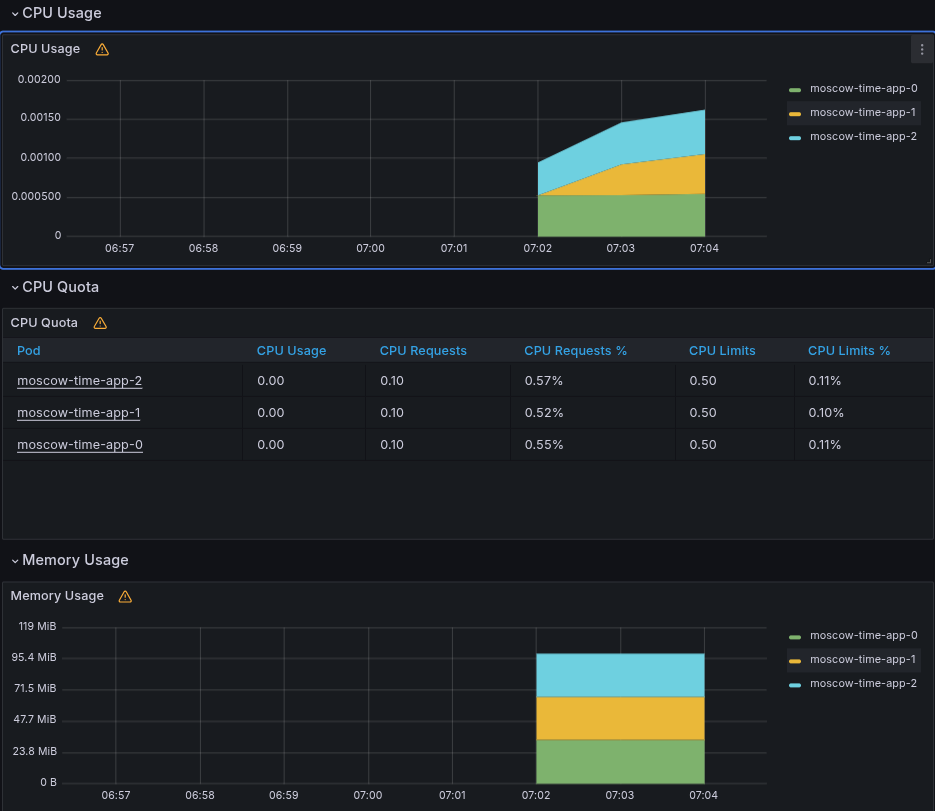
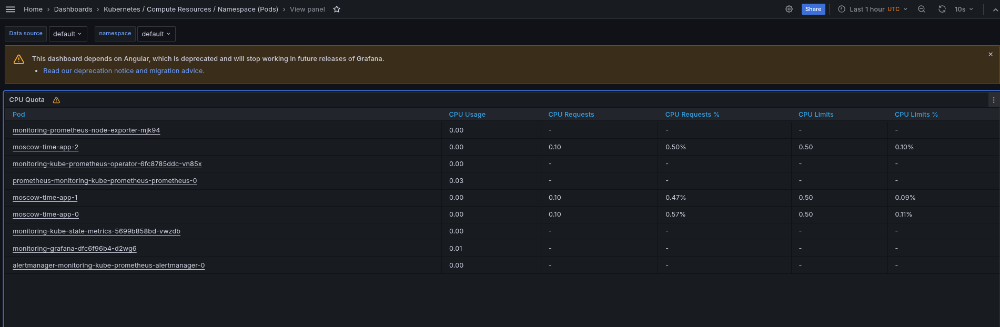
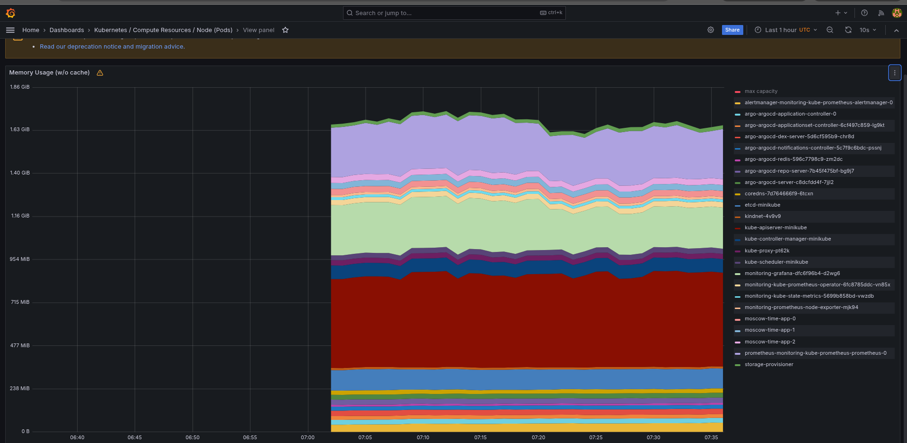
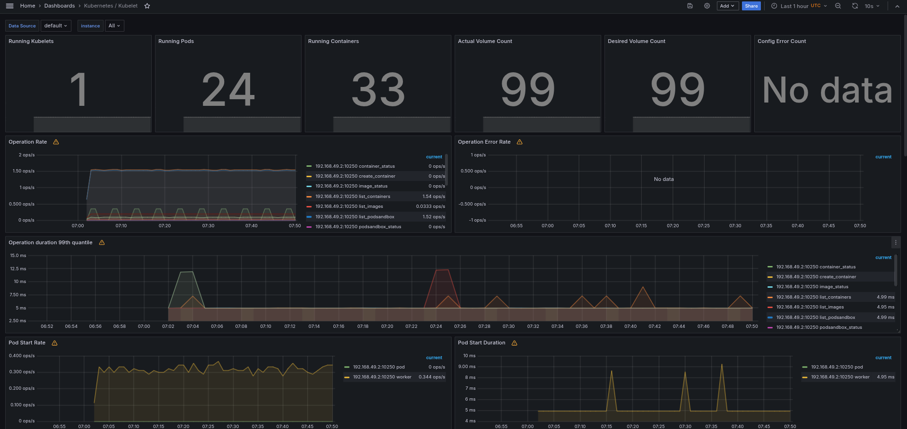
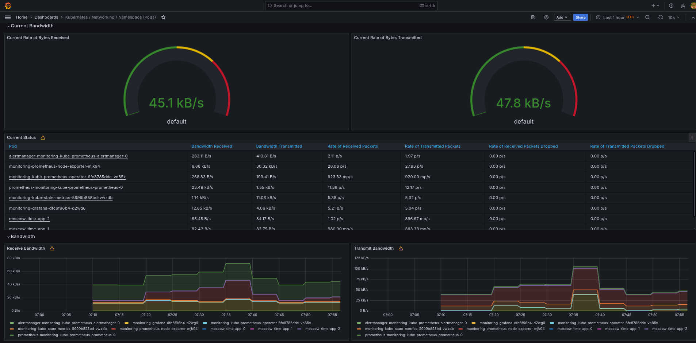
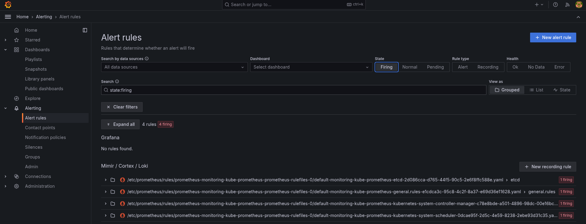
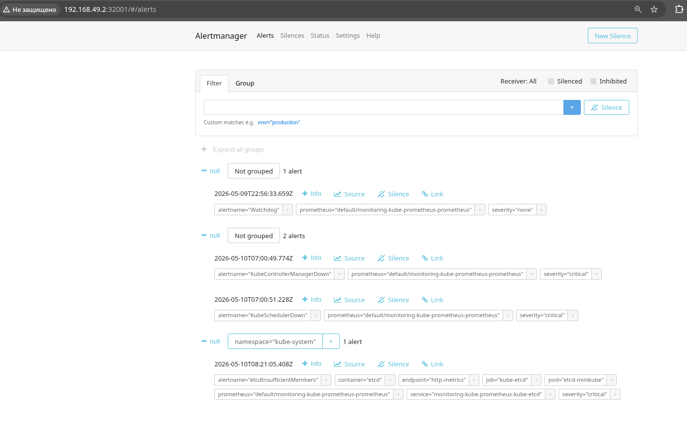

# Kubernetes monitoring with Kube Prometheus Stack

## Purpose

This document describes the monitoring setup for the Kubernetes cluster and the Moscow Time application. The monitoring stack is installed with Helm, and the application is deployed with the existing Helm chart.

## Components

### Prometheus Operator

Prometheus Operator is the controller that manages monitoring resources in Kubernetes. Instead of configuring Prometheus manually, the operator watches Kubernetes custom resources such as `Prometheus`, `Alertmanager`, `ServiceMonitor`, `PodMonitor`, and `PrometheusRule`, then creates or updates the required monitoring components.

### Prometheus

Prometheus collects metrics from Kubernetes components, nodes, pods, containers, and services. It stores time-series data and allows querying it with PromQL. In this setup, Prometheus is used as the main metrics database for cluster and application resource usage.

### Alertmanager

Alertmanager receives alerts generated by Prometheus rules. It groups, deduplicates, and routes alerts. In this setup, it is used to check the current number of active alerts in the cluster.

### Grafana

Grafana provides dashboards for visualizing metrics collected by Prometheus. It is used to inspect CPU, memory, network usage, pod/container counts, and StatefulSet resource consumption.

### kube-state-metrics

`kube-state-metrics` exports Kubernetes object state as metrics. It provides information about Deployments, StatefulSets, Pods, Services, PersistentVolumeClaims, ConfigMaps, and other Kubernetes resources.

### Node Exporter

Node Exporter collects operating system and node-level metrics, such as CPU usage, memory usage, filesystem usage, and network statistics from Kubernetes nodes.

### Kubernetes control plane and kubelet metrics

The stack also collects metrics from Kubernetes components and kubelet. Kubelet metrics are used to inspect pod/container counts and container-level CPU, memory, and network usage.

## Installation

The cluster should be started with Docker and containerd runtime:

```bash
minikube start --driver=docker --container-runtime=containerd
```

Add the Helm repository and install Kube Prometheus Stack:

```bash
helm repo add prometheus-community https://prometheus-community.github.io/helm-charts
helm repo update
helm upgrade --install monitoring prometheus-community/kube-prometheus-stack --version 57.2.0 \
  --set grafana.service.type=NodePort \
  --set grafana.service.nodePort=32000 \
  --set alertmanager.service.type=NodePort \
  --set alertmanager.service.nodePort=32001
```

Build the application image inside Minikube and install the application Helm chart:

```bash
minikube image build -t moscow-time-app:1.0.0 ./app_python
helm upgrade --install moscow-time-app ./k8s/moscow-time-app
```

Wait until all application pods are ready:

```bash
kubectl rollout status statefulset/moscow-time-app
```

## Kubernetes resources

Command:

```bash
kubectl get po,sts,svc,pvc,cm
```

Output:

```text
NAME                                                         READY   STATUS    RESTARTS   AGE
pod/alertmanager-monitoring-kube-prometheus-alertmanager-0   2/2     Running   0          74s
pod/monitoring-grafana-dfc6f96b4-d2wg6                       3/3     Running   0          75s
pod/monitoring-kube-prometheus-operator-6fc8785ddc-vn85x     1/1     Running   0          75s
pod/monitoring-kube-state-metrics-5699b858bd-vwzdb           1/1     Running   0          75s
pod/monitoring-prometheus-node-exporter-mjk94                1/1     Running   0          75s
pod/moscow-time-app-0                                        1/1     Running   0          28s
pod/moscow-time-app-1                                        1/1     Running   0          28s
pod/moscow-time-app-2                                        1/1     Running   0          28s
pod/prometheus-monitoring-kube-prometheus-prometheus-0       2/2     Running   0          74s

NAME                                                                    READY   AGE
statefulset.apps/alertmanager-monitoring-kube-prometheus-alertmanager   1/1     74s
statefulset.apps/moscow-time-app                                        3/3     28s
statefulset.apps/prometheus-monitoring-kube-prometheus-prometheus       1/1     74s

NAME                                              TYPE        CLUSTER-IP       EXTERNAL-IP   PORT(S)                         AGE
service/alertmanager-operated                     ClusterIP   None             <none>        9093/TCP,9094/TCP,9094/UDP      74s
service/kubernetes                                ClusterIP   10.96.0.1        <none>        443/TCP                         3h28m
service/monitoring-grafana                        NodePort    10.110.65.48     <none>        80:32000/TCP                    75s
service/monitoring-kube-prometheus-alertmanager   NodePort    10.102.228.161   <none>        9093:32001/TCP,8080:30817/TCP   75s
service/monitoring-kube-prometheus-operator       ClusterIP   10.110.131.132   <none>        443/TCP                         75s
service/monitoring-kube-prometheus-prometheus     ClusterIP   10.98.135.110    <none>        9090/TCP,8080/TCP               75s
service/monitoring-kube-state-metrics             ClusterIP   10.111.49.53     <none>        8080/TCP                        75s
service/monitoring-prometheus-node-exporter       ClusterIP   10.101.234.204   <none>        9100/TCP                        75s
service/moscow-time-app                           NodePort    10.103.0.250     <none>        8080:30080/TCP                  28s
service/moscow-time-app-headless                  ClusterIP   None             <none>        8080/TCP                        28s
service/prometheus-operated                       ClusterIP   None             <none>        9090/TCP                        74s

NAME                                             STATUS   VOLUME                                     CAPACITY   ACCESS MODES   STORAGECLASS   VOLUMEATTRIBUTESCLASS   AGE
persistentvolumeclaim/visits-moscow-time-app-0   Bound    pvc-7110c3d0-f439-4a7b-b02e-e3fec7bec45e   1Gi        RWO            standard       <unset>                 28s
persistentvolumeclaim/visits-moscow-time-app-1   Bound    pvc-9a5eb833-1715-48d7-bc49-d82ccf3c58a3   1Gi        RWO            standard       <unset>                 28s
persistentvolumeclaim/visits-moscow-time-app-2   Bound    pvc-a7e8b4b5-3b46-472d-b1f5-f5867664b922   1Gi        RWO            standard       <unset>                 28s

NAME                                                                     DATA   AGE
configmap/kube-root-ca.crt                                               1      3h28m
configmap/monitoring-grafana                                             1      76s
configmap/monitoring-grafana-config-dashboards                           1      76s
configmap/monitoring-kube-prometheus-alertmanager-overview               1      76s
configmap/monitoring-kube-prometheus-apiserver                           1      76s
configmap/monitoring-kube-prometheus-cluster-total                       1      76s
configmap/monitoring-kube-prometheus-controller-manager                  1      76s
configmap/monitoring-kube-prometheus-etcd                                1      76s
configmap/monitoring-kube-prometheus-grafana-datasource                  1      76s
configmap/monitoring-kube-prometheus-grafana-overview                    1      76s
configmap/monitoring-kube-prometheus-k8s-coredns                         1      76s
configmap/monitoring-kube-prometheus-k8s-resources-cluster               1      76s
configmap/monitoring-kube-prometheus-k8s-resources-multicluster          1      76s
configmap/monitoring-kube-prometheus-k8s-resources-namespace             1      76s
configmap/monitoring-kube-prometheus-k8s-resources-node                  1      76s
configmap/monitoring-kube-prometheus-k8s-resources-pod                   1      76s
configmap/monitoring-kube-prometheus-k8s-resources-workload              1      76s
configmap/monitoring-kube-prometheus-k8s-resources-workloads-namespace   1      76s
configmap/monitoring-kube-prometheus-kubelet                             1      76s
configmap/monitoring-kube-prometheus-namespace-by-pod                    1      76s
configmap/monitoring-kube-prometheus-namespace-by-workload               1      76s
configmap/monitoring-kube-prometheus-node-cluster-rsrc-use               1      76s
configmap/monitoring-kube-prometheus-node-rsrc-use                       1      76s
configmap/monitoring-kube-prometheus-nodes                               1      76s
configmap/monitoring-kube-prometheus-nodes-darwin                        1      76s
configmap/monitoring-kube-prometheus-persistentvolumesusage              1      76s
configmap/monitoring-kube-prometheus-pod-total                           1      76s
configmap/monitoring-kube-prometheus-prometheus                          1      76s
configmap/monitoring-kube-prometheus-proxy                               1      76s
configmap/monitoring-kube-prometheus-scheduler                           1      76s
configmap/monitoring-kube-prometheus-workload-total                      1      76s
configmap/prometheus-monitoring-kube-prometheus-prometheus-rulefiles-0   35     72s
```

### Explanation

The output confirms that both the Kube Prometheus Stack and the Moscow Time application were deployed successfully.

In the `po` section, all Pods are in the `Running` state and have `0` restarts. This means that the monitoring components and the application started without crashes. The monitoring stack includes Alertmanager, Grafana, Prometheus Operator, kube-state-metrics, node-exporter, and Prometheus itself. The application is running as three StatefulSet Pods: `moscow-time-app-0`, `moscow-time-app-1`, and `moscow-time-app-2`.

The `READY` column also confirms that all containers inside the Pods are ready. For example, `alertmanager-monitoring-kube-prometheus-alertmanager-0` shows `2/2`, and `prometheus-monitoring-kube-prometheus-prometheus-0` shows `2/2`, because these Pods include more than one container. Grafana shows `3/3`, so all Grafana-related containers are ready. The application Pods show `1/1`, meaning each application Pod has one container and it is ready.

In the `sts` section, three StatefulSets are visible. The `moscow-time-app` StatefulSet has `3/3` ready replicas, so all application replicas are running. Prometheus and Alertmanager are also managed as StatefulSets. This is expected because these components benefit from stable Pod identities and predictable names.

In the `svc` section, the monitoring stack exposes several Services. `monitoring-grafana` is a `NodePort` Service and is exposed on port `32000`, so it can be opened through Minikube. `monitoring-kube-prometheus-alertmanager` is also a `NodePort` Service and exposes Alertmanager on port `32001`. Prometheus, kube-state-metrics, node-exporter, and the Prometheus Operator use `ClusterIP` Services, which means they are available inside the cluster. The `alertmanager-operated` and `prometheus-operated` Services are headless Services used internally by the Prometheus Operator-managed workloads.

The application has two Services. `moscow-time-app` is a `NodePort` Service exposed on port `30080`, which allows access to the application through Minikube. `moscow-time-app-headless` has `ClusterIP: None`, so it is a headless Service. It is used by the StatefulSet to provide stable DNS records for individual Pods.

In the `pvc` section, there are three PersistentVolumeClaims: `visits-moscow-time-app-0`, `visits-moscow-time-app-1`, and `visits-moscow-time-app-2`. Each claim is in the `Bound` state, which means Kubernetes successfully provisioned storage for every application replica. Each Pod has its own `1Gi` volume with `ReadWriteOnce` access mode. This confirms that each StatefulSet replica stores its visit counter data separately.

In the `cm` section, the Kube Prometheus Stack created many ConfigMaps. These ConfigMaps contain Grafana configuration, dashboard definitions, Prometheus dashboard data, datasource configuration, and Prometheus rule files. For example, `monitoring-kube-prometheus-grafana-datasource` configures Grafana to use Prometheus as a data source. ConfigMaps such as `monitoring-kube-prometheus-k8s-resources-pod`, `monitoring-kube-prometheus-nodes`, and `monitoring-kube-prometheus-workload-total` provide preconfigured Grafana dashboards for Pods, nodes, and workloads. The `prometheus-monitoring-kube-prometheus-prometheus-rulefiles-0` ConfigMap contains Prometheus rules used for alerts and recording rules.

As a result, the output shows that the monitoring stack is operational, Grafana and Alertmanager are accessible through NodePort Services, the application is running as a three-replica StatefulSet, persistent storage is attached to every application Pod, and the monitoring stack has created the required dashboards, rules, and configuration objects.

## Grafana access

Grafana is exposed as a NodePort Service by the Helm values used during installation. This makes `minikube service monitoring-grafana` open the UI directly.

Command:

```bash
minikube service monitoring-grafana
```

Output:

```text
┌───────────┬────────────────────┬─────────────┬───────────────────────────┐
│ NAMESPACE │        NAME        │ TARGET PORT │            URL            │
├───────────┼────────────────────┼─────────────┼───────────────────────────┤
│ default   │ monitoring-grafana │ http-web/80 │ http://192.168.49.2:32000 │
└───────────┴────────────────────┴─────────────┴───────────────────────────┘
🎉  Opening service default/monitoring-grafana in default browser...
```

Grafana credentials:

```text
username: admin
password: prom-operator
```

## Grafana checks

### 1. CPU and memory consumption of the StatefulSet

Dashboard path:

```text
Home -> Dashboards -> Kubernetes / Compute Resources / Workload
```

Result:




Explanation:

The dashboard shows CPU and memory usage for the `moscow-time-app` StatefulSet. All three Pods are visible: `moscow-time-app-0`, `moscow-time-app-1`, and `moscow-time-app-2`.

CPU usage is very low for all replicas. In the CPU quota table, every Pod uses almost `0.00` CPU cores. Each Pod has a CPU request of `0.10` cores and a CPU limit of `0.50` cores. The current usage is less than 1% of the requested CPU and about 0.10–0.11% of the CPU limit. This is expected because the application only handles simple HTTP requests.

Memory usage is stable. The total memory usage for all three Pods is below `119 MiB`, and each Pod uses roughly 30–35 MiB. There is no abnormal memory growth visible on the graph.

As a result, the StatefulSet is running normally and consumes only a small part of the configured CPU and memory resources.

### 2. Pods with higher and lower CPU usage in the default namespace

Dashboard path:

```text
Home -> Dashboards -> Kubernetes / Compute Resources / Namespace (Pods)
```

Result:


Explanation:

The `Kubernetes / Compute Resources / Namespace (Pods)` dashboard was used with the `default` namespace selected.

According to the CPU Quota table, the Pod with the highest visible CPU usage is `prometheus-monitoring-kube-prometheus-prometheus-0`, with approximately `0.03` CPU cores. The lowest CPU usage is shown by several Pods with approximately `0.00` CPU cores, including `moscow-time-app-0`, `moscow-time-app-1`, and `moscow-time-app-2`.

This is expected because Prometheus performs metric collection and processing, while the Moscow Time application only handles simple HTTP requests and does not perform CPU-heavy background work.


### 3. Node memory usage in percentage and megabytes

Dashboard path:

```text
Home -> Dashboards -> Kubernetes / Compute Resources / Workload
```

Result:



Explanation:

The `Kubernetes / Compute Resources / Node (Pods)` dashboard was used with the `minikube` node selected.

The `Memory Usage (w/o cache)` panel shows memory usage on the selected node. According to the graph, the current memory usage is approximately `1.63 GiB`, while the visible maximum capacity is approximately `1.86 GiB`.

Approximate memory usage:

```text
1.63 GiB × 1024 ≈ 1669 MiB
1.63 / 1.86 × 100 ≈ 87.6%
```

So, during the check, the minikube node used approximately 1669 MiB of memory, or about 87.6% of the visible memory capacity. This includes Kubernetes system components, monitoring components, ArgoCD components, and the application Pods running on the node.

The Memory Quota table below the graph shows which Pods contribute to this memory usage. For example, the moscow-time-app Pods use about 32–33 MiB each, while heavier components such as Prometheus, Grafana, kube-apiserver, and ArgoCD-related Pods consume more memory.

### 4. Number of pods and containers managed by kubelet

Dashboard or query used:


Dashboard path:

```text
Home -> Dashboards -> Kubernetes / Kubelet
```

Result:



Explanation:

This means that the Minikube cluster has one active Kubelet instance. This Kubelet manages 24 running Pods and 33 running containers on the node. The number includes Kubernetes system components, monitoring stack components, ArgoCD components, and the Moscow Time application Pods.

### 5. Network usage of Pods in the default namespace

Dashboard path:

```text
Home -> Dashboards -> Kubernetes / Networking / Namespace (Pods)
```

Result:



Explanation:

The current total receive bandwidth in the `default` namespace is approximately `45.1 kB/s`, and the current total transmit bandwidth is approximately `47.8 kB/s`.

The highest visible network activity is generated by monitoring components. For example, `monitoring-prometheus-node-exporter-mjk94` transmits about `30.32 kB/s`, while `prometheus-monitoring-kube-prometheus-prometheus-0` receives about `23.49 kB/s`.

The Moscow Time application Pods generate much less traffic. For example, `moscow-time-app-2` shows about `85.45 B/s` receive bandwidth and `84.17 B/s` transmit bandwidth. This is expected because the application only handles simple HTTP requests during the check.

The dropped packet columns show `0.00 p/s`, so no packet drops were observed. No visible network issues were detected for Pods in the `default` namespace.

### 6. Number of active alerts

#### Grafana

Web path:

```text
Home -> Alerting -> Alert rules
```

Result:


Explanation:

The number of active alerts was checked in Grafana through Prometheus Explore with the following query:

`count(ALERTS{alertstate="firing"})`

During the check, Grafana showed `4` active alerts.

Alertmanager is also exposed as a NodePort Service by the Helm values used during installation.

#### Alertmanager

Open Alertmanager:

```bash
minikube service monitoring-kube-prometheus-alertmanager
```

Output:

```text
┌───────────┬─────────────────────────────────────────┬───────────────────┬───────────────────────────┐
│ NAMESPACE │                  NAME                   │    TARGET PORT    │            URL            │
├───────────┼─────────────────────────────────────────┼───────────────────┼───────────────────────────┤
│ default   │ monitoring-kube-prometheus-alertmanager │ http-web/9093     │ http://192.168.49.2:32001 │
│           │                                         │ reloader-web/8080 │ http://192.168.49.2:30817 │
└───────────┴─────────────────────────────────────────┴───────────────────┴───────────────────────────┘
[default monitoring-kube-prometheus-alertmanager http-web/9093
reloader-web/8080 http://192.168.49.2:32001
http://192.168.49.2:30817]
```

Result:



Explanation:

The Web UI was checked additionally. It showed three active alert groups: `1 alert`, `2 alerts`, and `1 alert`, which gives `4` active alerts in total.
