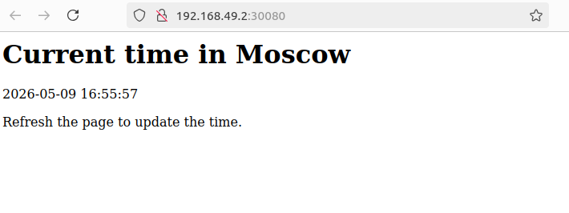

# Lab 9: Introduction to Kubernetes

## Application

The application used in this lab is the Flask Moscow Time App from `app_python`.

Before running Kubernetes commands, build the image inside the Minikube Docker environment:

```bash
minikube start
eval $(minikube docker-env)
docker build -t moscow-time-app:lab9 ./app_python
```

## Task 1: Kubernetes Setup and Basic Deployment

### Create Deployment imperatively

```bash
kubectl create deployment moscow-time-app --image=moscow-time-app:lab9 --port=8080
```

### Create Service imperatively

```bash
kubectl expose deployment moscow-time-app --type=NodePort --port=8080 --target-port=8080
```

### Check Pods and Services

```bash
kubectl get pods,svc
```

Output:

```text
NAME                                  READY   STATUS    RESTARTS   AGE
pod/moscow-time-app-b6fc54d88-nrfbc   1/1     Running   0          14s

NAME                      TYPE        CLUSTER-IP     EXTERNAL-IP   PORT(S)          AGE
service/kubernetes        ClusterIP   10.96.0.1      <none>        443/TCP          71m
service/moscow-time-app   NodePort    10.97.84.223   <none>        8080:31103/TCP   7s

```

### Cleanup

```bash
kubectl delete service moscow-time-app
kubectl delete deployment moscow-time-app
```

Output:

```text
service "moscow-time-app" deleted from default namespace
deployment.apps "moscow-time-app" deleted from default namespace
```

## Task 2: Declarative Kubernetes Manifests

The declarative manifests are stored in this folder:

- `deployment.yml`
- `service.yml`

The deployment uses 3 replicas as required.

### Apply manifests

```bash
kubectl apply -f k8s/deployment.yml
kubectl apply -f k8s/service.yml
```

Output:

```text
deployment.apps/moscow-time-app created
service/moscow-time-app created
```

### Check Pods and Services

```bash
kubectl get pods,svc
```

Output example:

```text
NAME                                   READY   STATUS    RESTARTS   AGE
pod/moscow-time-app-6c97cc86f9-5g8tn   1/1     Running   0          19s
pod/moscow-time-app-6c97cc86f9-q5c29   1/1     Running   0          19s
pod/moscow-time-app-6c97cc86f9-qbmw8   1/1     Running   0          19s

NAME                      TYPE        CLUSTER-IP       EXTERNAL-IP   PORT(S)          AGE
service/kubernetes        ClusterIP   10.96.0.1        <none>        443/TCP          73m
service/moscow-time-app   NodePort    10.110.120.181   <none>        8080:30080/TCP   14s
```

### Minikube Service URL

```bash
minikube service --all
```

Output:

```text
┌───────────┬────────────┬─────────────┬──────────────┐
│ NAMESPACE │    NAME    │ TARGET PORT │     URL      │
├───────────┼────────────┼─────────────┼──────────────┤
│ default   │ kubernetes │             │ No node port │
└───────────┴────────────┴─────────────┴──────────────┘
😿  service default/kubernetes has no node port
┌───────────┬─────────────────┬─────────────┬───────────────────────────┐
│ NAMESPACE │      NAME       │ TARGET PORT │            URL            │
├───────────┼─────────────────┼─────────────┼───────────────────────────┤
│ default   │ moscow-time-app │ http/8080   │ http://192.168.49.2:30080 │
└───────────┴─────────────────┴─────────────┴───────────────────────────┘
❗  Services [default/kubernetes] have type "ClusterIP" not meant to be exposed, however for local development minikube allows you to access this !
🎉  Opening service default/moscow-time-app in default browser...

```

### Browser result

Opened URL:

```text
http://192.168.49.2:30080
```

Browser page result:



### Cleanup after Task 2

```bash
kubectl delete -f k8s/service.yml
kubectl delete -f k8s/deployment.yml
```
