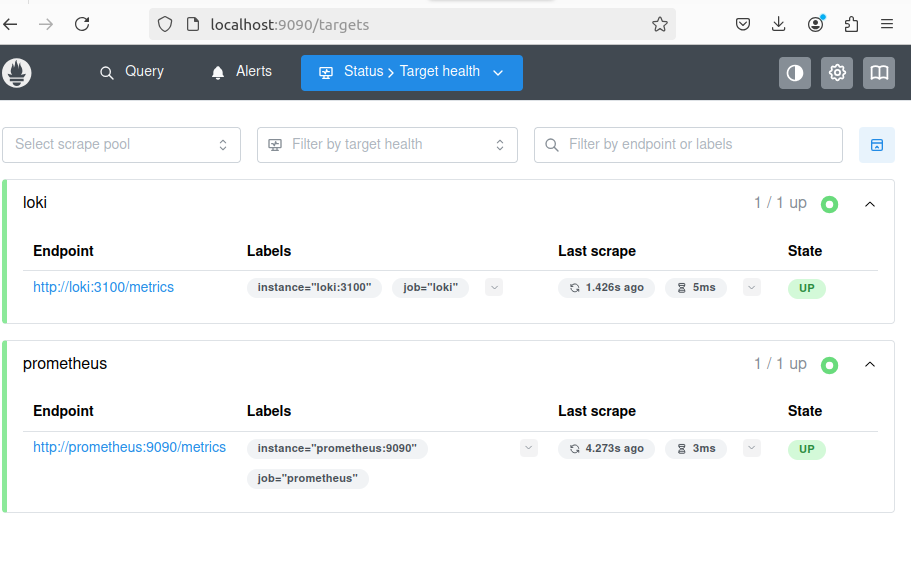

# Metrics

## Prometheus setup

The monitoring stack was extended with a Prometheus container. Prometheus is started from `docker-compose.yml` and uses `prometheus-config.yaml` as its configuration file.

Prometheus is available at:

```text
http://localhost:9090
```

The targets page is available at:

```text
http://localhost:9090/targets
```

## Scrape configuration

The current Prometheus configuration collects metrics from two targets required for Task 1:

| Job | Target | Purpose |
| --- | --- | --- |
| `prometheus` | `prometheus:9090` | Prometheus scrapes its own metrics. |
| `loki` | `loki:3100` | Prometheus scrapes Loki metrics. |

Configuration file:

```yaml
global:
  scrape_interval: 15s
  evaluation_interval: 15s

scrape_configs:
  - job_name: prometheus
    static_configs:
      - targets:
          - prometheus:9090

  - job_name: loki
    static_configs:
      - targets:
          - loki:3100
```

## Verification

The stack can be started from the `monitoring` directory:

```bash
docker compose up -d --build
```

After the containers start, open `http://localhost:9090/targets`. The page should show both configured jobs in the `UP` state:

- `prometheus` / `prometheus:9090`
- `loki` / `loki:3100`

## Screenshots

Prometheus deployment:

![Prometheus deployment] (images/prometheus-deployment.png)

Prometheus targets page:




