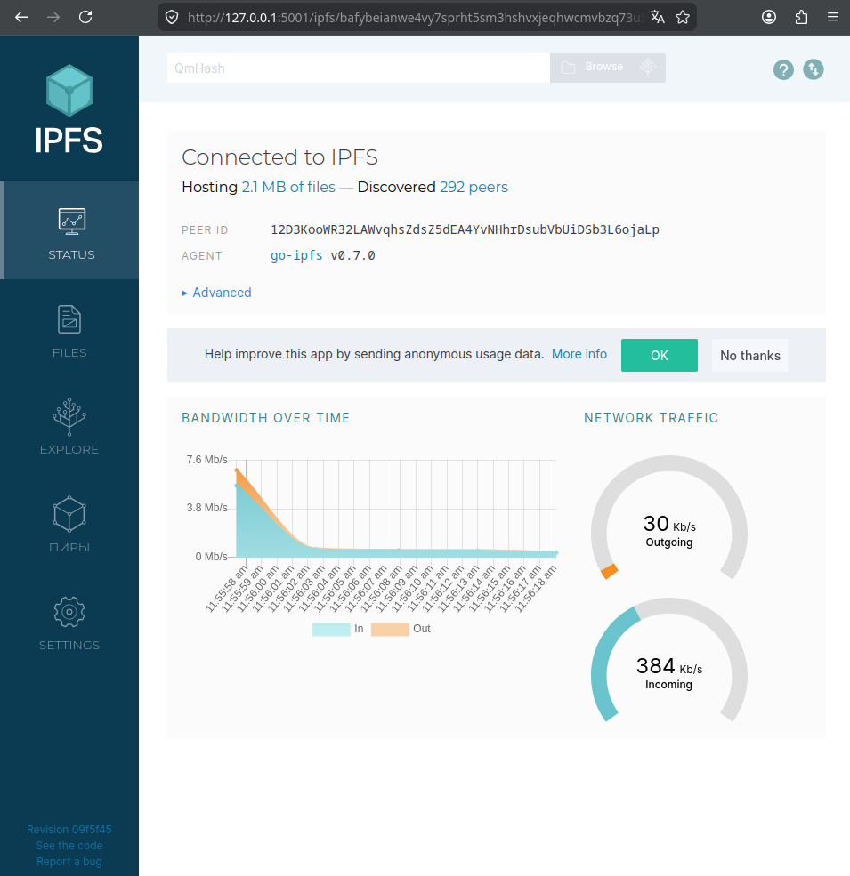
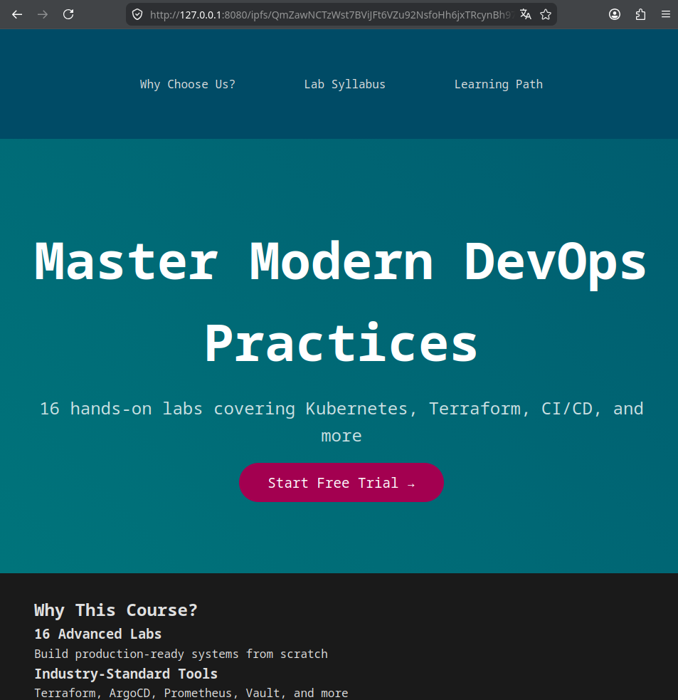

# IPFS gateway with Docker

## Objective

The goal of this work is to run a local IPFS node in Docker, upload a file to IPFS, check node connectivity and bandwidth, and verify the uploaded file through public IPFS gateways.

## Test file

The uploaded file is stored in the repository at:

```text
ipfs/index.html
```

This file is mounted into the IPFS container through `/export`.

## Run IPFS node

Command:

```bash
docker pull ipfs/go-ipfs:v0.7.0
```

Output:

```text
v0.7.0: Pulling from ipfs/go-ipfs
1d67993a1320: Pull complete 
4c59bceac128: Pull complete 
dbeb113e010f: Pull complete 
b2d221698d1d: Pull complete 
daa4177942f5: Pull complete 
b46a107e8a2e: Pull complete 
440d62aec8fa: Pull complete 
3a5b4625debc: Pull complete 
495126049458: Pull complete 
bd16fa642a19: Pull complete 
ccabf164d027: Pull complete 
97445ec934e3: Pull complete 
efcee0d38ba7: Pull complete 
dca9151a696e: Pull complete 
Digest: sha256:d5bc45bd354e3fef2161adb0daa7dc390316589cfdcc6b0edc1ad13ac66626fd
Status: Downloaded newer image for ipfs/go-ipfs:v0.7.0
docker.io/ipfs/go-ipfs:v0.7.0
```

Command:

```bash

docker run -d --name ipfs_host \
  -v "$PWD/ipfs:/export" \
  -v ipfs_data:/data/ipfs \
  -p 8080:8080 \
  -p 4001:4001 \
  -p 5001:5001 \
  ipfs/go-ipfs:v0.7.0
```

Output:

```text
1735bbc57d7426a0386a531d220ab48eb8863d5763fb804eea473f91dd88a179
```

Command:

```bash
docker ps --filter name=ipfs_host
```

Output:

```text
CONTAINER ID   IMAGE                 COMMAND                  CREATED              STATUS              PORTS                                                                                                                                                       NAMES
1735bbc57d74   ipfs/go-ipfs:v0.7.0   "/sbin/tini -- /usr/…"   About a minute ago   Up About a minute   0.0.0.0:4001->4001/tcp, [::]:4001->4001/tcp, 0.0.0.0:5001->5001/tcp, [::]:5001->5001/tcp, 0.0.0.0:8080->8080/tcp, [::]:8080->8080/tcp, 4001/udp, 8081/tcp   ipfs_host
```

The IPFS Web UI is available at:

```text
http://127.0.0.1:5001/webui/
```



## Connected peers

The container was left running for several minutes to connect to the IPFS network.

Command:

```bash
docker exec ipfs_host ipfs swarm peers
```

Output:

```text
/ip4/1.40.140.178/tcp/4001/p2p/12D3KooWFf8rRmmQHJja3KsXXcwVNjXJKaQkiPM3W3Wf81NdxZwb
/ip4/104.238.144.149/tcp/4001/p2p/12D3KooW9q6VFjzk9k95j9CdZU9QGCx495HxsGxqU8u6FsD1G75R
/ip4/104.245.200.134/tcp/42983/p2p/12D3KooWKBiev7w6qfBpX5HwQsthmXrHAigV55CWw7h2AjVK1Fcw
/ip4/107.152.35.40/tcp/4001/p2p/12D3KooWM8cWzKjpVA5cksvDX3W3aQiiQc4FqFNhcFk4aU3TueYM
/ip4/107.191.52.146/tcp/4001/p2p/12D3KooWETqQmVb6uV9QPTTFSN6bgNoNG2smAanpeNqnwscXoiSw
/ip4/108.54.18.158/tcp/4001/p2p/12D3KooWAj25SrgNYJKsKzNnM3F3YPtHigomqooxeTcYcLoedF4v
/ip4/108.61.251.216/tcp/4001/p2p/12D3KooWKwuYxQYSgK36kLvf7ofZc7SJdQoMDyxKdaNFkZoNi3Kx
/ip4/109.199.108.144/tcp/4001/p2p/12D3KooWPtWUAXEjnSWQY1TqiCejASF3Ue7w9KsSLYj1YS93B7hL
/ip4/109.199.116.1/tcp/4001/p2p/12D3KooWDGiSH96weCnrHAouaaMbRjQSfTDMCxaprZwQ7QDsgMre
/ip4/128.140.74.157/tcp/4001/p2p/12D3KooWFVbi9omfhLKZj6vZQtUcuMEcN74o6KohYiC9fjGsN6de
/ip4/129.151.69.9/tcp/4001/p2p/12D3KooWFWHQnbL3FEMJTjKrhaxw5J14cdnoPn8E7nh4P7rHsNpy
/ip4/13.230.233.179/tcp/4001/p2p/12D3KooWHS1PQMT9wBEWZJ3D7HXGmWDWTjrh8nLeAsRPS5BtbRYf
/ip4/133.125.14.10/tcp/4001/p2p/12D3KooWJhnNPG8RcrajGgeJNLiomJPQzDXgQJYd9SfD3PkVhJx7
/ip4/135.125.232.165/tcp/4001/p2p/12D3KooWP1iEJ8dWS9XfcKnz2Y6koE8PWnCJ3Dz11trnJBg3MuMb
/ip4/135.181.2.45/tcp/4001/p2p/12D3KooWCvBSyooxfGTrTPLZpypBDAqc3KiNi75KPKbb1LD2fYfE
/ip4/135.181.3.221/tcp/4001/p2p/12D3KooWMH4hRLwnNMu6JDZCFRFqYBXEyo8bfYYoT4sqi2Nx48NS
/ip4/135.19.29.38/tcp/4001/p2p/12D3KooWSVfzj1PsfmwLjQ86SEEJMZdoubSRgJES8rdfdugiCTqx
/ip4/136.49.173.135/tcp/4001/p2p/12D3KooWPH3guw6ak4TyY9cVTCzdXadJ58MvSAkBjkHn61tquzt5
/ip4/138.197.14.6/tcp/4001/p2p/12D3KooWAUmbnph4Lhcwcy1bRWfzGQtoMjTmM9P2TkeXVbPHE1Lk
/ip4/139.180.159.143/tcp/4001/p2p/12D3KooWFUujLWEc2tWcxgm168J1dor1YyvgkA55hg1QaJHd783F
/ip4/139.60.162.107/tcp/4001/p2p/12D3KooWQ4SqVkyLhDkJwveSj6sNsxQivGFUXVrvsSBXqvzi2FH6
/ip4/139.60.162.37/tcp/4001/p2p/12D3KooWRdjAkhZyqBf3ynAgebcDPSDzZhwk3PhkJRTbgXGw2xnQ
/ip4/14.55.131.131/tcp/47083/p2p/QmZ1GnujFyycHWkLH6XuqhhWimdSaqyEB4ojiRSinPRW1U
/ip4/14.55.131.164/tcp/35083/p2p/QmNzQemZgT8e23WeS379fkeSe1LEFhRoPUoUMznjwe2DJG
/ip4/143.110.156.190/tcp/4001/p2p/12D3KooWSLUQhhW6jN2tg9s5y6CFQngB5TYcT9Q6MHArvTjBN8Nb
/ip4/143.198.181.227/tcp/4001/p2p/12D3KooWAaLw75jSHkebxK53XUjNGZGhRDKa3TCMQddsNhBbSKh1
/ip4/144.126.145.29/tcp/4001/p2p/12D3KooWSmBSUPo6f67vDtpxrBcDipjtn5KBQN88Fw8amEgzfLpG
/ip4/144.172.122.97/tcp/4001/p2p/12D3KooWEKPYsZESwcjLuJoNNppiDJuJM71a92ti9P2yB65rrXEE
/ip4/145.40.61.14/tcp/4001/p2p/12D3KooWKuqoDL7zz83VhENuYzLzzVhAwsBbkJuyF6BgXPJNHer4
/ip4/146.59.70.17/tcp/4001/p2p/12D3KooWMZBUyNkTvA8itMqsgDiS9udYuqtTg8uTu1oV41uLw3f5
/ip4/147.135.36.31/tcp/4001/p2p/12D3KooWDLjSDtCT6aFigwjvkGjP9aL2NzEWp7xzggbcn9E9EBDD
/ip4/147.182.148.121/tcp/4001/p2p/12D3KooWJUCBYpVhpQYUF3ahXFaDJPp3TsMpWRaQTExfqfNLcd7M
/ip4/148.113.170.231/tcp/4001/p2p/12D3KooWBzUpGc5MZBTRSUKkdZN4BxqxwefJVbCmTJ4SquU4WJay
/ip4/148.113.221.111/tcp/4001/p2p/12D3KooWR7n9NKtxMKtXzuw9rpb5w95CkQa3bLnakJYkASdZMnxL
/ip4/149.102.132.207/tcp/4001/p2p/12D3KooWKKZ1qVm8QBoVKfcaGCqUTL4QVaFXUPS5TFCGmfCs28qB
/ip4/149.102.154.87/tcp/4001/p2p/12D3KooWDBes8wVxdKebN6E3w3AabQbY7onytsMEuYmMyfMT6Qf9
/ip4/149.28.44.127/tcp/4001/p2p/12D3KooWH4sLr9XgDc8KZfq5N52rRtHHJu628o2pc6nbbSQNgyQd
/ip4/152.53.65.116/tcp/4001/p2p/12D3KooWT3Ye1Fo2bXoA4FrTc9B8TTQjw21RdTHLcT8NvZUjifXc
/ip4/154.38.168.39/tcp/4001/ws/p2p/12D3KooWPwwFG3szNtp2G4r3F5a49vErPTsd1BKid7JTqtL86JjR
/ip4/154.91.1.155/tcp/19988/p2p/12D3KooWCFokEyt9gtuQHTwVAzwBsdjsBqfSxq1D3X1FsAbTwaSN
/ip4/157.180.13.174/tcp/4001/p2p/12D3KooWDND4FSHCXSv1Z1fYqdxMXYScikxpm3nRYaGvLcnrdGuQ
/ip4/157.90.32.77/tcp/4001/p2p/12D3KooWGRFDB7Ho8vNQ21tDRHk2HmJx319XEuMMwvh3CkhQALDF
/ip4/159.65.119.106/tcp/9874/p2p/Qmdfjtk6hPoyrH1zVD9PEH4zfWLo38dP2mDvvKXfh3tnEv
/ip4/16.59.83.202/tcp/9905/p2p/12D3KooWAqmWemJordsU5HWZKQVCBTRGLzQeDGzDHj4ydFFEiCGK
/ip4/161.97.154.176/tcp/9020/p2p/QmRdKvrGyWVxwXTcu4YiC5bPMLPqFSmneDG1jwuUnQcn2W
/ip4/161.97.154.177/tcp/20220/p2p/QmNUBaEf6n3QUVaA2BmxUBSk3C1i2JmtC8KWUG1edzL1Ty
/ip4/161.97.84.9/tcp/14001/p2p/QmXUTDRW6ipuvp8VsLz1Ldww65DuHXkQ2NSEn6FudLtzjd
/ip4/162.120.19.82/tcp/4001/p2p/12D3KooWNwv8qVGDNSJQs6hvYw4vUkksA5Rk6NNv31mxLuVhPBkU
/ip4/162.19.99.69/tcp/4001/p2p/12D3KooWLLLopE29AevYnqZZyutQZ9g7Da7PeSjfgrtHRMpvyK4F
/ip4/167.172.229.150/tcp/40075/p2p/12D3KooWEnav9QmEkHeuXiYR9YA6fS6GjviphECFc8JCxjpjeYAh
/ip4/168.138.172.29/tcp/4001/p2p/12D3KooWHP4TKpWd2NSzqqdqdrNR2NxXnVjNfbc7uRdGC6zHsG9a
/ip4/172.104.143.23/tcp/4001/p2p/12D3KooWFv6ZcoUKyaDBB7nR5SQg6HpmEbDXad48WyFSyEk7xrSR
/ip4/172.104.215.180/tcp/4001/p2p/12D3KooWCdRL6LBSgLkXwXgFG6SbagtEFnop6v9Ho5veumQGakpS
/ip4/172.104.74.4/tcp/4001/p2p/12D3KooWFvTrEyepjMU5jWUG98YhS1TE246g4L7YmA4au87Tskmw
/ip4/172.233.29.33/tcp/4001/p2p/12D3KooWExNdP7McwBWMpd8S52WiQX5PbrJUQpy2WcES9mA8s4nM
/ip4/172.93.186.179/tcp/4001/p2p/12D3KooWNNVQHwruf4z5U4LXfUmGjRB7PgpHz3wwoRcTPmtV5cuA
/ip4/176.168.169.173/tcp/4001/p2p/12D3KooWGZ48W6M9gmr6tdsFmfVekEsUqRZiD8ZtJ1iH3H39BfAY
/ip4/176.9.46.83/tcp/9000/p2p/QmVo6ZqzkfdDDcPY8VszPVsLFaimcD4WcEBpPNQZTdyGfm
/ip4/177.70.219.183/tcp/49384/p2p/QmQj8sAG7HPX3MRPk3yiwk63fagsX9e8GDPi9r4akWeyLL
/ip4/178.119.86.122/tcp/4001/p2p/12D3KooWHPysV3nj1r3LK7L947A7ZYU8tuMT6mKiKL3sSjg7UoGs
/ip4/178.200.22.69/tcp/4001/p2p/12D3KooWNnYeUMmugke8EAii4eGVPrtnLUv7Fipeo7f3P5WHuuxD
/ip4/18.133.235.96/tcp/4001/p2p/12D3KooWByFomfQgLhCsQxFPCJ6D5ikhz686dvZceC2JdJjxu7QZ
/ip4/18.191.46.171/tcp/4001/p2p/12D3KooWEeAuQdbZ6VepZEvZ6kCuMfzFMXBj65aMiZ6cBobMJFvs
/ip4/18.216.118.101/tcp/4001/p2p/12D3KooWGMgSouP9i7DeVBnWvPJWesaJeTk6eTvB7WUvoTBHXzAQ
/ip4/181.90.222.229/tcp/4001/p2p/12D3KooWBien1U3HhtSFi2Bgghg6mx1oHXiPry83fSawte9pU2t8
/ip4/185.234.72.142/tcp/4001/p2p/12D3KooWKtJxJdEL8ffBi8MD9ypeTYX8aJGKPjXCBxyJDnTyVPtK
/ip4/185.255.131.86/tcp/4001/p2p/12D3KooWHe8oAxnaP9hetvDBxVADfRrPnhEc7nirs3VXYLCXHKsJ
/ip4/188.112.56.182/tcp/4001/p2p/12D3KooWP8myRatjrSHr4bkavgwnnx7YecETxXBBBKupgmf46Z3m
/ip4/188.149.47.14/tcp/4001/p2p/12D3KooWS4eZyxxZ5ZDcN7fbb2B4FAVwovQtXiDWPXCSoVQXk4NR
/ip4/189.90.194.113/tcp/48888/p2p/12D3KooWNNGM3gcf6aVkR9hY7fRQPgUsBTxS2pwZ2dutz6Ddgsqt
/ip4/192.248.158.198/tcp/4001/p2p/12D3KooWH42NYrqDzkg7LUhTqLvo4WdcETbKcooWHNM6QKHsi4Fj
/ip4/192.3.1.215/tcp/4001/p2p/12D3KooWNTR7DmR9Xj5xFeYTMDhTc1EBcWJDoWmhvoXEmfePw28R
/ip4/192.81.213.80/tcp/4001/p2p/12D3KooWPSKXimwVZEhN13h8DB8nj4iDs39r1wprLr1EnjwAdBCm
/ip4/192.99.21.16/tcp/4001/p2p/12D3KooWE55vHKNRjaWwDBZsqsGitB7fXvZ9pr7VZixzgwae4uDV
/ip4/193.11.118.5/tcp/4001/p2p/12D3KooWPcsFofqUUJGdpEuCbPgSoPyE8vLqaJN513rMkmMm1Egh
/ip4/193.149.176.167/tcp/4001/p2p/12D3KooWBEPt3iUfAwc7evDxosNbRQqcWNHwRUV2kFQt49EprtDm
/ip4/193.163.71.24/tcp/8104/p2p/12D3KooWM2DfmhFaq62hLGtwh976mcL9ro6h1zcM1Fhabn2x8BpF
/ip4/194.163.145.252/tcp/4001/p2p/12D3KooWCSG2QpavGzX3mi1NjGW1jDiwqWRXSoMZKBU2zF91FMw7
/ip4/198.178.224.159/tcp/4001/p2p/12D3KooWHZuTs8bdaiU37RDFyPUqkep2mcniXyFe9V5jqpJ2qJe2
/ip4/198.199.70.27/tcp/4001/p2p/12D3KooWQkhEVFkPvf5U93wRFfn88mC6n8JFfp1XARhMKqyyXEoA
/ip4/198.244.179.206/tcp/4001/p2p/12D3KooWDpp7U7W9Q8feMZPPEpPP5FKXTUakLgnVLbavfjb9mzrT
/ip4/198.46.143.174/tcp/4001/p2p/12D3KooWQs3MjqTt2HvfC6hkyBKAJNiaELMJ1SJUnHN6ni2W9iBX
/ip4/20.234.167.249/tcp/4001/p2p/12D3KooWNnFt83QrTx9dAXou1FG8UBxQT3bgQBujLvwWWzCzdVET
/ip4/203.161.33.105/tcp/4001/p2p/12D3KooWPEZjQ8PqVGxs7AU7Bm5TxeFiZc5gaSv4H4qEWh5hNHK9
/ip4/203.90.226.40/tcp/4001/p2p/12D3KooWAFZjSjMeSYVD6ntj8HAW42eJfj91WFb2S1F8F2NtqVMz
/ip4/205.172.59.121/tcp/4001/p2p/12D3KooWNUAyA1kUaE5fZoYyhQbjAqNawSMZCSk8fedVJ4qrcyTY
/ip4/205.209.126.226/tcp/4001/p2p/12D3KooWQ5hZ35bSpRFXhfp7HxEkBrKJVhWB4Num6sG1PELAnvpD
/ip4/205.250.111.107/tcp/4001/p2p/12D3KooWNC45JMiJH4S7Ss3TBdxkYBMpijaCNTPokXs7SyqC9AHh
/ip4/206.189.124.214/tcp/4001/p2p/QmRFS7Kfo6Hn16faNFt8RgEqE2khrSBH6WdhZvzLWTWiYv
/ip4/207.148.3.252/tcp/4001/p2p/12D3KooWF8dbeU4XtZJMFwfhNz6MQN2fskDXLfKQWMjgqHbrrQzU
/ip4/207.148.5.133/tcp/4001/p2p/12D3KooWPNBJhzu4N484U7wWYQdYxE1qBrF7xeuVRg2ErQzqVD56
/ip4/209.38.100.182/tcp/4001/p2p/12D3KooWNMikZxzho3pm3J6PpPJ9tjkmVToG5iNzJDzhLiLzBMD7
/ip4/209.53.42.163/tcp/4001/p2p/12D3KooWCRfxpi92voGcfcCZ2gMEr3Y3VdsYbdnM5Mu4q7xfrzEY
/ip4/211.75.3.112/tcp/4002/p2p/12D3KooWC2NBXHiCQ2n6Wm3ycPG29boziR7e8H2R4rrpHVX9RyaY
/ip4/212.69.86.103/tcp/4001/p2p/12D3KooWGzgbxieCcQhTLcnCJfrGr5qWN8YBnb4DpL3rWZarWUsk
/ip4/212.69.86.110/tcp/4001/p2p/12D3KooWJavFriYPjgjBpp2CnAzNy6GxtQQ2sgwmpJR1EC2vBDGg
/ip4/212.69.86.89/tcp/4001/p2p/12D3KooWMdduEQCNqyAvcK1kGFJQ6rAoefrnthuqQcNMRsrHZn84
/ip4/212.69.86.91/tcp/4001/p2p/12D3KooWBkucUNk54rY2Cq1Gaz98wbz4Q5srs1YVeL9i4gjtbNTp
/ip4/212.69.86.93/tcp/4001/p2p/12D3KooWCdcWxmmduJcDRGtnPQ3CxPU5we2EXAKtb1wBMqwSCWV8
/ip4/213.66.17.48/tcp/4001/p2p/12D3KooWAXzNexycknNMa9WhreHEYJarUrgEK2xDgui2Eyg9fUTA
/ip4/217.216.53.15/tcp/4001/p2p/12D3KooWQ6LEdwgjnRz1QLveJko8D1xTRXTFsLfhRBSr5CCuWcQG
/ip4/220.73.87.107/tcp/48888/p2p/12D3KooWK3TpENqwcYetakPg6QpnEcEk8KqgBzjtrTRotfxuwD9E
/ip4/221.144.149.111/tcp/60702/p2p/QmZ9dJRBMLpTwnrGGSWdyQwtVyBvhQJmymVndqLg117KTE
/ip4/221.144.149.121/tcp/47612/p2p/QmcxdpmwXJAjehG4XoHbYVxHLwNEGzspkSsCshPssojhG6
/ip4/221.159.246.111/tcp/43574/p2p/QmaqGRyKwZEr9tc8A6HyVJGAcGdi3zmuX1zE5k6pokfETM
/ip4/223.167.209.158/tcp/4001/p2p/12D3KooWE5GPNF4smARuDzz5imDhyLEkJSsKw171abkBWJzX97id
/ip4/3.1.22.36/tcp/4001/p2p/12D3KooWJe5qgAYsWmh6vBZMbnYhTTpMv49DzBubRk7CdG2WhEnB
/ip4/3.235.188.32/tcp/4001/p2p/12D3KooWM1TC7kNNeGCGPSJW8KaHMosVi6ZXHGaEo6pgGumrxcKS
/ip4/3.86.105.36/tcp/4001/p2p/12D3KooWPxFgLpdcCKBrequyrQLUL6LDJm66QDLZdu28H4kHjkPV
/ip4/31.97.48.104/tcp/4001/p2p/12D3KooWHzuuVgmR4CryxcpDSetigSXFCAv4D9wTLsdPYdfieJEu
/ip4/34.29.74.41/tcp/4001/p2p/12D3KooWGbStdSKeCb1MvASdpcDHARLMYNNjhHx34M8QS41v7yTu
/ip4/34.66.184.251/tcp/4001/p2p/12D3KooWDnHgurUuHgEsUrHBcaicNvbcKMLnfPYQBYun4AjLqGLa
/ip4/36.153.26.18/tcp/35582/p2p/QmcW8FaebNYYHMNZx57x6brRGZ6JobU642g7SCQaUPcXfU
/ip4/37.27.233.221/tcp/4001/p2p/12D3KooWREU6wntxHd8xmbY4EBQK2DTRrne3g6nkmprFiXDggGi4
/ip4/37.27.59.21/tcp/4001/p2p/12D3KooWKJRkStnNA8pUw4n8obPrPDR8vzoKAPhGsrvHgTnonW2k
/ip4/38.191.246.166/tcp/49268/p2p/QmdTz1zsuJG1j1s5tPTFoiB67MgtnaAUNT8ZPgYhwJRb9Z
/ip4/43.229.135.96/tcp/4001/p2p/12D3KooWQKj18y6xhRgjjFUDQfXKVqZodLt47WbCko1ZV9ctufFe
/ip4/43.229.79.27/tcp/4001/p2p/12D3KooWJm5Soz9ZYsqYe86UgDTXnxZidAQyre6EcDZu7yjWmtdh
/ip4/44.205.10.127/tcp/4001/p2p/12D3KooWHMfH3f4XuwYKDXST6Pv9CZHKfXwEUMnSJaNtW3S1TEGN
/ip4/45.11.56.54/tcp/4001/p2p/12D3KooWG8qfgMa5VRTSx16NWpkZL1ffmXAwtEayaFvzyGm4MMHs
/ip4/45.119.155.29/tcp/4001/p2p/12D3KooWSDf4XJDaH3ovbDoZS8zd5MyLbGMHFiJEu1R4br3Ga9yE
/ip4/45.32.198.126/tcp/4001/p2p/QmTM7GnNsmSR4piCgpKRSuJcs9poqHcy3QfSsEmjvkc6S4
/ip4/45.32.211.190/tcp/4001/p2p/12D3KooWRVmghwcytQsC9TGgAHz8XSxZcRBtEjyxxEKusxnin2ta
/ip4/45.59.160.140/tcp/4001/p2p/12D3KooWGgUrCXrT99MvpWE2uA7YBiPxmNwpcheuhC7U2PbJbHjo
/ip4/45.77.89.194/tcp/4001/p2p/12D3KooWJ1WJZYE39rdSrpjyzFEeU3F6fsy4SN7hrXNy3MKiUhrV
/ip4/46.110.178.59/tcp/16628/p2p/12D3KooWE95pSd9hP2pWbQGnnfpSFHCz5fq13Wr1EpB3LATVfDJm
/ip4/46.250.248.28/tcp/4001/p2p/12D3KooWPbnnJvr7RHEuoFhdUh4DcLmS496S3z6fjWSotFvN6wTt
/ip4/46.255.204.220/tcp/4001/p2p/12D3KooWJBw9CSUWQi7P7amZsjrsBAzoB2gJzyUUGkuBkdLc87co
/ip4/46.255.204.222/tcp/4001/p2p/12D3KooWGepRJ4kWvkWyDkTt4BZmCiNzEifMnEvr21y2PNDPMxrf
/ip4/46.4.139.101/tcp/4001/p2p/12D3KooWDEVHeYjb4DN7vk6nypmesak63YCZocYYVnBf3Ty7uGsx
/ip4/46.62.228.203/tcp/4001/p2p/12D3KooWAmax1cGWxmwHWShSdEc5Mxp3e3ecUTPpg1W6PBVPyNpC
/ip4/47.187.31.116/tcp/4001/p2p/12D3KooWKau1XrqFB5URggM67QC1CMNyz1xWHrTFPy9owsm5igSF
/ip4/47.242.238.164/tcp/4001/p2p/12D3KooWCcuGzfuVqwtj6jPcjeztDF2RVh2ikvGBLpqWNXAC4Wqf
/ip4/49.13.117.140/tcp/4001/p2p/12D3KooW9u81yrYEPuLY2NwbtcFfFCg712WibwJXxPRDXR6bsT6B
/ip4/49.13.218.215/tcp/4001/p2p/12D3KooWBV7ugDC7Mw8iLjQukodhrkfFohPeq4iaZhEUKJ88b7Pp
/ip4/5.189.86.189/tcp/48888/p2p/12D3KooWP7iSCh9Q4eBG8RomZe4tcwE59QiaD8GRBcjUXxZPhhdt
/ip4/50.46.242.167/tcp/4001/p2p/12D3KooWKHc7VKaBfw5HeDKRWgwhAQhJBENVdQo5PBHHRm6Nmu2d
/ip4/51.158.37.170/tcp/4001/p2p/12D3KooWHeB1cDgkFoWvJoDxx3eDyBTypX641EgYzRB2m2K2tU2z
/ip4/51.222.111.103/tcp/4001/p2p/12D3KooWGud1vNeAs3Yha7wHvShnm3xDua3hTAZuAhti44uqAqc5
/ip4/51.79.228.40/tcp/4001/p2p/12D3KooWEmTNjhVcKw14MZD2TVovzDDmLuzM3GrwHi7nEVS7c4zB
/ip4/51.81.93.51/tcp/4001/p2p/QmQCU2EcMqAqQPR2i9bChDtGNJchTbq5TbXJJ16u19uLTa
/ip4/51.83.220.155/tcp/4001/p2p/12D3KooWHh9pDYwV55PABZw8Y718MUfwQNeKUNFfT9dkCA79RJg1
/ip4/54.154.20.214/tcp/4001/p2p/12D3KooWQZXAy2oJSijZiCEY6b4ZfGXwBDasXbH39V5iiQKsYGoK
/ip4/57.129.53.209/tcp/4001/p2p/12D3KooWAbaYNhayYxDAFMHAzgBaa2g5ch4EkMLeE1av98RpaUrB
/ip4/58.189.40.200/tcp/4001/p2p/12D3KooWAYkkp8Rjzpzq21pwQ7FMERGY3cwcyhBBG94ZhsH1SVVK
/ip4/64.20.34.126/tcp/4001/p2p/12D3KooWCVKTzLHWH41bRHHUZoWBbZX2EjMDSxxjHL8o2SYTiz8V
/ip4/64.227.102.229/tcp/4001/p2p/12D3KooWH8tQJTzKZfGqNgnMcA7UvASnNQazM5kMLWZt3vxZ5dDn
/ip4/65.108.133.87/tcp/9000/p2p/QmNRaJQdFY8tzNu6enEjsMhW5Dadwb1fk5JnJKpKFcjH6H
/ip4/65.108.66.123/tcp/9000/p2p/QmUDjudrcM4wNXDZUzJnnTNeQUXnexCVLH1Gg1f5sJ6HjX
/ip4/65.109.147.95/tcp/4001/p2p/12D3KooWNduFjuhTf8Wu9z5vGDoAg5jPSGNG9m7yq2esztYuzUeN
/ip4/65.109.33.87/tcp/4001/p2p/12D3KooWKvgo7gzmRHRK5R1A749fXpnZXgQWjGpgVDm59Gfynvsh
/ip4/65.109.60.106/tcp/4001/p2p/12D3KooWCUNDGEnkPuWUrBhn8NMjnTuzzsP5giD1dG8CXa4fio6q
/ip4/65.109.60.254/tcp/4001/p2p/12D3KooWL96RJHMjvPzkDzEwSBNei4Ftak7n8gF5Tfn8Dc1cSYQn
/ip4/65.109.90.222/tcp/4001/p2p/12D3KooWPBQwyEPcmwXusmi6GEkBVqx2FasftPbq12FAAPgfi4hr
/ip4/65.109.95.56/tcp/4001/p2p/12D3KooWP3XF1Mgewq189BKJgwbhRio7FgPkVsFeXBjZKoXs8Ksa
/ip4/65.21.11.27/tcp/4001/p2p/12D3KooWQekBbPwv1C9yqDXeuBqn1ngttagY4wXT75BXEgzrabL5
/ip4/65.21.233.22/tcp/4001/p2p/12D3KooWNb6j8nKMkofMWn3SLEdM2f1oTSCnL7ZFoCnY7bVn4Nop
/ip4/66.199.251.191/tcp/44401/p2p/12D3KooWLp4Y7Ykukk66EU34N238RwqUV7ZBriCJK1GuD72qeSer
/ip4/68.134.224.48/tcp/4001/p2p/12D3KooWATWKPJqxk1ftWmXtrxh5XAuKgyTYjdSdQvHY2Zysk9Zr
/ip4/69.5.145.158/tcp/4001/p2p/12D3KooWEp5bCsWH69BtSzZGXzdt6sUBogS8G6wzibtUHyYwHx2S
/ip4/69.67.149.19/tcp/9000/p2p/Qmb3jX77dz2oeam8TadgCJawAEwD7VY17uox76XdJyF98t
/ip4/70.162.238.193/tcp/4001/p2p/12D3KooWMgcDCajpj95TJFhu1P2VpQX6G3KzC4QXXSZshr2YeaGU
/ip4/70.34.196.30/tcp/4001/p2p/12D3KooWMEXvSL4N8pULAHqFbnmLBCEQt12JRraUQjpsUdH1mRpp
/ip4/70.77.76.219/tcp/58556/p2p/12D3KooWNJKtuPxYQ8vQFNfb6AB32vuG34ejGYHcTKnp3swcJGhV
/ip4/72.11.144.192/tcp/4001/p2p/12D3KooWJt9EDYjGmhG5j72NSiMQLgKUpF35kna8avLbVaKbpCTb
/ip4/72.56.99.58/tcp/4001/p2p/12D3KooWQWjvbBjXcZPW9EBs54Dbig3j9w9m8uUAzBxopF2Sjb7q
/ip4/73.54.203.35/tcp/4001/p2p/12D3KooWEhY9w5QvN87ovUS5mBwqPc3V32fqMcS4i2DJX8AdooZi
/ip4/74.48.78.146/tcp/38479/p2p/12D3KooWCNejSUEM8qCqyfgLaNDGgaucmhRW8d1ouDEpKFBdwMEC
/ip4/77.222.41.123/tcp/4001/p2p/12D3KooWMGxmExjpJpQ8TVPz9BqePPAGA9izNnVXvC4q54YZJWMK
/ip4/79.116.22.209/tcp/14900/p2p/12D3KooWAYRvRkE94Fdyj63FY6Jxm7ziEjN4yGhjLzP9qeoPgusv
/ip4/80.240.18.133/tcp/4001/p2p/12D3KooWHQoA4DPmN8CpnbZ1N1QA7mW4HqsSogSiJasMX8eaSMqZ
/ip4/80.241.211.36/tcp/4001/p2p/12D3KooWAgfPCtaDHjrKmNvnhyaDSbYC3yBJW5iLTbKQrML3iRZP
/ip4/81.107.109.247/tcp/59664/p2p/12D3KooWNTWsmoA1B56bserR9PNu1GqqaRVihMcUiJtn4FR51gco
/ip4/82.168.190.146/tcp/4001/p2p/12D3KooWHe5RKvwSoru5iHV1smbA6h45qYrHnpKkM76mjJiBAkZG
/ip4/84.247.129.57/tcp/4001/p2p/12D3KooWEHwsXJe36RCTH4Vsdf99NSqExGMQe2AwY6TzzzgWAjac
/ip4/85.95.186.41/tcp/4001/p2p/12D3KooWQQkYoEegYrntJAFQGycRAu4XwHUBfLH3hCNXsZDVVmCn
/ip4/87.119.139.207/tcp/4001/p2p/12D3KooWPqSeZQk8ZM5m84UTAcjRUrSUnNdfL2z7e6UZFKerXDQz
/ip4/89.117.151.135/tcp/4001/p2p/12D3KooWLxHxLqGmRFxuP8iaSnLMdxYKX6F6mukCWTNukDMTN9LW
/ip4/89.117.73.68/tcp/4001/p2p/12D3KooWAAYqZKT4QTTwuQwg1gVMp3hd3s5RgqmFNJMdQfLKdwSA
/ip4/91.134.4.17/tcp/4001/p2p/12D3KooWMYSisLAq7tgYCUHc6kZGCL1Z9TerJj8TgFkucPNukbCv
/ip4/91.240.130.224/tcp/4001/p2p/12D3KooWFtRPpkgcFFYhawgVd8GMR4gUHCsXEJgUHnYDVei9sb4Y
/ip4/92.118.231.142/tcp/4001/p2p/12D3KooWSPdy4AMC8MXrBdtA5HTjzoXBtRDLR4XhecZ9Nv2PSiob
/ip4/92.206.166.254/tcp/4001/p2p/12D3KooWJU5pbvvW6kprGhRM2hDkfpQVxgbQEYepYjxvDC7dRzW5
/ip4/94.250.203.3/tcp/4001/p2p/12D3KooWFSUGRyFbcNnQh4Qf5PYR7rL2okeWXnr7i514hcnNV4vp
/ip4/95.105.53.24/tcp/57707/p2p/QmPigdJJZztEbU1HBW8Q5NJ59YDG1UKGqfRAZEZjEyffkY
/ip4/95.179.135.73/tcp/4001/p2p/12D3KooWPpp3pM9WRx7WWs2iH69MqowWUjkvLfy7NbM3PMHXPNom
/ip4/95.179.145.217/tcp/4001/p2p/12D3KooWT2cbzYaNzmPkQ41RU5u7fsXmwS5p4Pw3uavyATHktL8e
/ip4/95.179.166.6/tcp/4001/p2p/QmRc8yiHsiW3gP6hoCn7sA8xvYJiJdA5a7tZoSRNYxzcXX
/ip4/95.179.226.14/tcp/4001/p2p/12D3KooWQAWtoeu7sSHK99RpqPwbf7AvwYm7kJSSMwAGKGLQsRbN
/ip4/95.216.15.31/tcp/4001/p2p/12D3KooWFbSiti3oMg6igk8Ex7SQsHZHYFv86b7Qyn6qZxCypHdT
/ip4/95.216.46.113/tcp/4001/p2p/12D3KooWR5TRwpai7faAEjaSGdDh84Q94TW4EJRoMzsEX6Y99c83
/ip4/95.217.207.158/tcp/4001/p2p/12D3KooWH3b4LN7xyXyStuFXy463CptTRBhYVsRQpYsW7xfuW2DU
```

Command:

```bash
docker exec ipfs_host ipfs swarm peers | wc -l
```

Output:

```text
84
```

This shows how many peers the local IPFS node is connected to.

## Bandwidth statistics

Command:

```bash
docker exec ipfs_host ipfs stats bw
```

Output:

```text
Bandwidth
TotalIn: 14 MB
TotalOut: 1.4 MB
RateIn: 30 kB/s
RateOut: 2.9 kB/s
```

The bandwidth output shows the total amount of data received and sent by the IPFS node, as well as the current receive and send rates.

## Upload file to IPFS

The `ipfs/index.html` file was uploaded through the IPFS Web UI.

The same file can also be added from the mounted `/export` directory to verify the CID from the command line:

```bash
docker exec ipfs_host ipfs add /export/index.html
```

Output:

```text
 8.88 KiB / ? added QmZawNCTzWst7BViJFt6VZu92NsfoHh6jxTRcynBh97cGj index.html
 8.88 KiB / 8.88 KiB  100.00%
```

CID:

```text
QmZawNCTzWst7BViJFt6VZu92NsfoHh6jxTRcynBh97cGj
```

```text
http://127.0.0.1:8080/ipfs/QmZawNCTzWst7BViJFt6VZu92NsfoHh6jxTRcynBh97cGj
```



## Public gateway verification

The uploaded file was checked using public IPFS gateways.

```text
https://ipfs.io/ipfs/QmZawNCTzWst7BViJFt6VZu92NsfoHh6jxTRcynBh97cGj
https://cloudflare-ipfs.com/ipfs/QmZawNCTzWst7BViJFt6VZu92NsfoHh6jxTRcynBh97cGj
https://ipfs.infura.io/ipfs/QmZawNCTzWst7BViJFt6VZu92NsfoHh6jxTRcynBh97cGj
```

Result:

```text
https://ipfs.io/ipfs/QmZawNCTzWst7BViJFt6VZu92NsfoHh6jxTRcynBh97cGj returned 504 Gateway Timeout.
https://cloudflare-ipfs.com/ipfs/QmZawNCTzWst7BViJFt6VZu92NsfoHh6jxTRcynBh97cGj failed with a DNS resolution error.
https://ipfs.infura.io/ipfs/QmZawNCTzWst7BViJFt6VZu92NsfoHh6jxTRcynBh97cGj returned 504 Gateway Timeout.
```

Public gateway availability can vary, so a failed gateway request does not necessarily mean that the local upload failed. The local CID and IPFS node output are the primary proof that the file was added to IPFS.

## Cleanup

Command:

```bash
docker rm -f ipfs_host
```

Optional command to remove the persistent IPFS data volume:

```bash
docker volume rm ipfs_data
```
